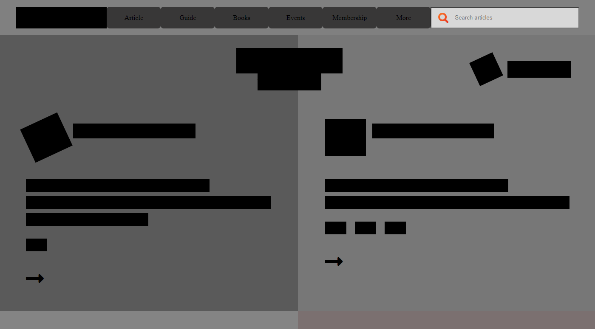

# Design Teardown

Design Teardown Heatmap

#HTML and CSS: Design Teardown

On the branch more-content we created the entire project that includes the styling and the skeleton of the HTML.
We applied flex boxes, floats, and CSS grids.

## Built With

- HTML,
- CSS,

## Live Demo

[Live Demo Link](https://bigwizzo.github.io/heatmap)

👤 **Devkc**

- Github: [@githubhandle](https://github.com/cvilla714)
- Twitter: [@twitterhandle](https://twitter.com/kckeyti)
- Linkedin: [linkedin](https://www.linkedin.com/in/cosmel-villalobos-1900531aa/)

👤 **Bigwizzo**

- Github: [@githubhandle](https://github.com/Bigwizzo)
- Twitter: [@twitterhandle](https://twitter.com/willnyamunokora)
- Linkedin: [linkedin](https://www.linkedin.com/in/willnyamunokora)
